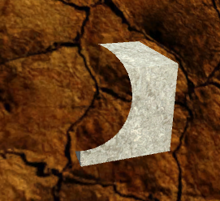
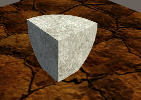
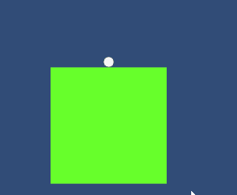

# MeshBoolean
Make Boolean Operator on Mesh. In Unity.

对网格做布尔操作（合集、交集、差集）。有两种途径，一是操作网格，二是利用Shader达到看起来像那么回事的效果。

# Scenes
## 差集
#### JustWriteZ场景
  

## 合集
#### JustWriteBackZ场景
  

#### ClipHoleByDistance场景

## 弹坑
弹坑部分密集化，其他部分尽量稀疏。

## 2d挖孔洞
